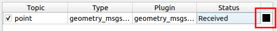
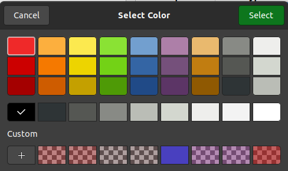

Changing the Layer Color
########################

The ability to modify layer colors at runtime is useful for when:

* An overlay is difficult to notice in the image (eg. A green overlay drawn over a green part of an image)
* Two layers are indistinguishable from each other (eg. Two layers using the same plugin type, listening on different topics)

To change the color of a layer, simply **double-click** the color tile in the rightmost column of
the layer, as highlighted below:

A color dialog will pop up, where you can select a color, or create your custom color.
By default, the layer color is black.

Once you press the Select button to close the dialog, you should see the layer update with the color
you selected. In the image below, a light green color was selected:

.. image:: images/green_layer.png
  :align: center

.. tip::

  The transparency of the layer can also be modified using a custom color.