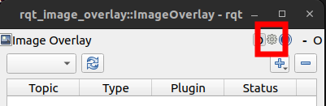
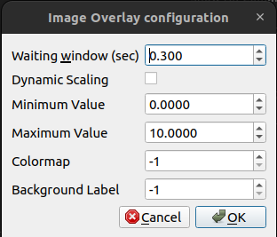

.. _Configurations:

Configurations
##############

Configurations for RQt Image Overlay can be modified through a dialog that is brought up by clicking on the gear icon as shown below:

Clicking on the gear icon will bring up the following dialog:

The settings in the dialog are explained below:

* **Waiting Window (sec)** - The number of seconds to wait before displaying the image overlay in :ref:`Timestamp Synchronization`.
  The default is 0.3s, but you can increase this if you have a large delay between when the image is received and the other messages are received.

The following options only apply to images with a single channel (eg. grayscale images, depth images).
Often, such images don't have a range of 0-255, so scaling must be performed to bring the values into the range of 0-255:

* **Dynamic Scaling** - If true, the min/max value in the image is evaluated from the image data, and used to dynamically scale the image.
  If false, the Minimum Value and Maximum Value below are used to perform non-dynamic scaling.
* **Minimum Value** - Minimum Value used for non-dynamic scaling. Pixels below this value in the original image will be scaled to 0 in the output image.
* **Maximum Value** - Maximum Value used for non-dynamic scaling. Pixels above this value in the original image will be scaled to 255 in the output image.
* **Colormap** - Colormap which the source image is converted with. See `ColorMaps in OpenCV`_ for valid values. If set to -1 (default), a colormap will not be applied.
* **Background Label** - Background label when colorizing label image. If set to -1 (default), the background label will be ignored.

.. _ColorMaps in OpenCV: https://docs.opencv.org/4.x/d3/d50/group__imgproc__colormap.html
