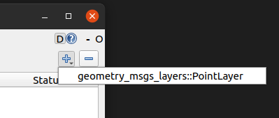
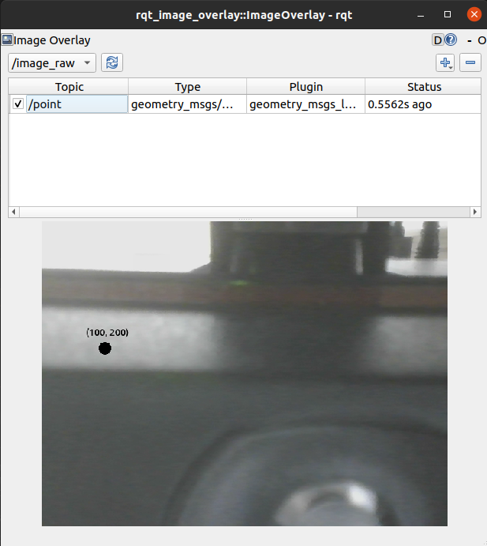

.. _Creating a Layer:

Creating a Layer 
################

In this tutorial, you will create a layer that draws a published `geometry_msgs::Point`_
onto a published image. The instructions are similar to the `Creating and Using Plugins (C++)`_ tutorial.

1. Create a Package
*******************

Create a new empty package in your workspace ``src`` directory:

.. code-block:: console

    ros2 pkg create geometry_msgs_layers --build-type ament_cmake --dependencies rqt_image_overlay_layer geometry_msgs --library-name point_layer

The command:

* Created a package called geometry_msgs_layers
* Added code to CMakeLists.txt of the new package, to generate a library called *point_layer*
* Generated files ``include/geometry_msgs_layers/point_layer.hpp`` and ``src/point_layer.cpp``

2. Write point_layer.hpp
************************

Open the generated ``include/geometry_msgs_layers/point_layer.hpp`` file in your favorite editor,
and paste the following instead of it:

.. code-block:: cpp

    #ifndef GEOMETRY_MSGS_LAYERS__POINT_LAYER_HPP_
    #define GEOMETRY_MSGS_LAYERS__POINT_LAYER_HPP_

    #include "geometry_msgs_layers/visibility_control.h"
    #include "rqt_image_overlay_layer/plugin.hpp"
    #include "geometry_msgs/msg/point.hpp"

    namespace geometry_msgs_layers
    {

    class PointLayer : public rqt_image_overlay_layer::Plugin<geometry_msgs::msg::Point>
    {
    protected:
      void overlay(
        QPainter & painter,
        const geometry_msgs::msg::Point & msg) override;
    };

    }  // namespace geometry_msgs_layers

    #endif  // GEOMETRY_MSGS_LAYERS__POINT_LAYER_HPP_

Your PointLayer class must inherit the class rqt_image_overlay_layer::Plugin<T> where ``T`` is the msg
type you are displaying in the layer (ie. ``geometry_msgs::msg::Point``).

3. Write point_layer.cpp
************************

Open the generated ``src/point_layer.cpp`` file in your favorite editor, and paste the following
instead of it:

.. code-block:: cpp

    #include <QPainter>
    #include "geometry_msgs_layers/point_layer.hpp"

    namespace geometry_msgs_layers
    {

    void PointLayer::overlay(
      QPainter & painter,
      const geometry_msgs::msg::Point & msg)
    {
      painter.translate(msg.x, msg.y);

      painter.save();
      QPen pen = painter.pen();
      pen.setCapStyle(Qt::RoundCap);
      pen.setWidth(20);
      painter.setPen(pen);
      painter.drawPoint(0, 0);
      painter.restore();

      painter.translate(-30, -20);
      QString str = "(%1, %2)";
      painter.drawText(0, 0, str.arg(msg.x).arg(msg.y));
    }

    }  // namespace geometry_msgs_layers

    #include "pluginlib/class_list_macros.hpp"

    PLUGINLIB_EXPORT_CLASS(geometry_msgs_layers::PointLayer, rqt_image_overlay_layer::PluginInterface)

The implementation of point_layer.cpp consists of drawing a black point
and drawing the coordinate as text above it.

The arguments to the ``PLUGINLIB_EXPORT_CLASS`` macro, are:

1. The fully-qualified type of the layer class, in this case, geometry_msgs_layers::PointLayer.
2. The fully-qualified type of the base class, this is always rqt_image_overlay_layer::PluginInterface

.. important::

    **The base class is** ``rqt_image_overlay_layer::PluginInterface``, which is a
    non-templated in-direct parent class. 
    The direct parent class ``rqt_image_overlay_layer::Plugin<T>`` cannot be a base
    class for plugins because it is a template class.

4. Plugin Declaration XML
*************************

A `Plugin Declaration XML`_ file must be created to store meta-data about the package.

In the package, create ``plugins.xml`` with the following code:

.. code-block:: xml

    <library path="point_layer">
      <class type="geometry_msgs_layers::PointLayer" base_class_type="rqt_image_overlay_layer::PluginInterface">
        <description>This is an rqt_image_overlay layer for geometry_msgs::Point</description>
      </class>
    </library>

.. tip::

    See `Plugin Declaration XML`_ from the official ROS2 tutorials to get familiar with the XML tags.

5. CMake Plugin Declaration
***************************

`CMake Plugin Declaration`_ is required file for the package to be recognised as an
rqt_image_overlay_layer plugin.

In your package's CMakeLists.txt, add the ``pluginlib_export_plugin_description_file`` line after
the existing ``ament_target_dependencies`` line as follows:

.. code-block::

    ament_target_dependencies(
      point_layer
      "rqt_image_overlay_layer"
      "geometry_msgs"
    )

    pluginlib_export_plugin_description_file(rqt_image_overlay_layer plugins.xml)

.. important::

    The first argument to ``pluginlib_export_plugin_description_file`` (ie. ``rqt_image_overlay_layer``)
    is the plugin category your layer belongs to, not the name of your layer.

6. Build and Run
****************

Navigate back to the root of your workspace, and build your new package:

.. code-block:: console

    colcon build --packages-select geometry_msgs_layers

In a new terminal, source your workspace, and either run rqt, or rqt_image_overlay:

.. code-block:: console

    ros2 run rqt_image_overlay rqt_image_overlay

You should be able to see your new layer when you go to add a layer, as following:

7. Testing
**********

In a fresh terminal, publish a point ``(100.0, 200.0)`` on topic ``point`` by running:

.. code-block:: console

    ros2 topic pub point geometry_msgs/msg/Point "
    x: 100.0
    y: 200.0
    z: 0.0"

In rqt_image_overlay, add a geometry_msgs_layer::PointLayer, and set the image topic and
set the plugin's topic to ``point``. You should see the point layer over the image, as below:

Congratulations! You now know how to visualize any custom ros msg topic onto an image!

.. _Creating and Using Plugins (C++): https://docs.ros.org/en/rolling/Tutorials/Pluginlib.html
.. _geometry_msgs::Point: https://github.com/ros2/common_interfaces/blob/master/geometry_msgs/msg/Point.msg
.. _Plugin Declaration XML: https://docs.ros.org/en/rolling/Tutorials/Pluginlib.html#plugin-declaration-xml
.. _CMake Plugin Declaration: https://docs.ros.org/en/rolling/Tutorials/Pluginlib.html#cmake-plugin-declaration
