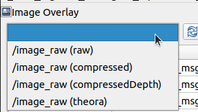

Different Image Transports
##########################

`Image Transport`_ is used to subscribe to images, which provides transparent support for
transporting images in low-bandwidth compressed formats.
By using different image transports, you can achieve faster image transportation with possibly
a higher frame rate.

To use another image transport, install the image transport on the machine publishing the image,
and on the machine running RQt Image Overlay, if they differ.

Refresh the image topics in RQt Image Overlay, and you should see alternative transports available,
as shown in the image below:

.. tip::
  By using a transport such as `compressed`, you may get better visualization.

.. _Image Transport: http://wiki.ros.org/image_transport