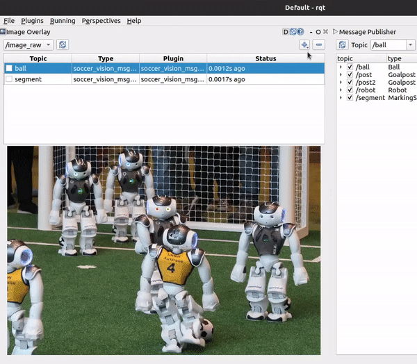

.. rqt_image_overlay documentation master file, created by
   sphinx-quickstart on Thu Dec 30 16:41:06 2021.
   You can adapt this file completely to your liking, but it should at least
   contain the root `toctree` directive.

RQt Image Overlay
=================

RQt Image Overlay is an RQt plugin that lets you **easily draw information from topics onto a
camera image and view them in RQt**.

GIFs are worth a thousand words!, so:

In case you didn’t quite get what’s going on, what you see is three layer plugins that are
listening to three user-defined msg topics being toggled on and off.

You can effortlessly write your own plugins for RQt Image Overlay to display your custom msg type.
All you have to implement is the method that does the drawing, given the msg to draw and the QImage
to draw it onto.

Background
**********

Previously, a common way of achieving something similar was to write a node that
subscribes to the topics you want to visualize and the image, draw the topics, and republish
the resulting image. This method had several disadvantages:

* Bandwidth being used to republish images
* Inability to toggle layers on/off
* Had to write code to subscribe to the topics and image
* Had to write code tp publish the output image
* Can’t easily reuse the code to draw a certain msg type between projects
* Have to recompile to add/remove layers, can’t do this during runtime

We're happy you're here!
************************

The project is hosted on `Github`_ by ROS Sports. **Issues and Pull Requests are welcome!**

.. toctree::
   :hidden:
   :maxdepth: 2

   installation
   usage
   creating-a-layer
   changing-the-layer-color
   timestamp-synchronization
   image-transports
   configurations
   examples

.. _Github: https://github.com/ros-sports/rqt_image_overlay
