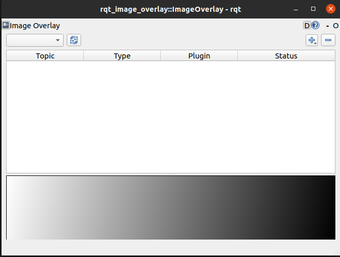
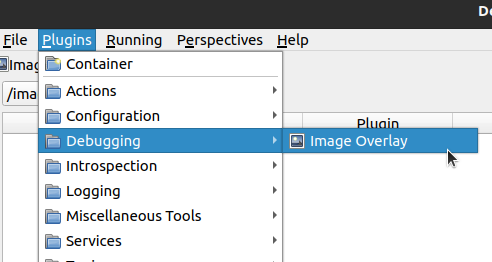
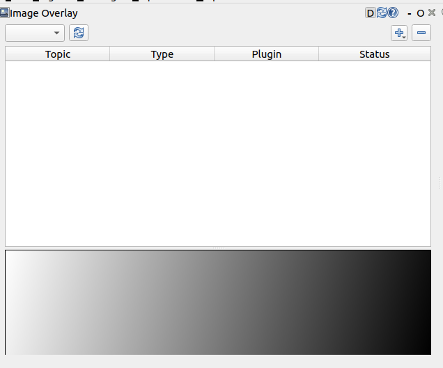
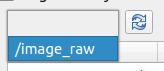
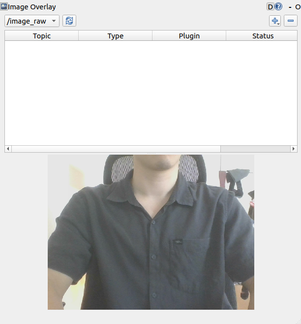

Usage
#####

.. warning::

    Remember to source your workspace with ``. install/local_setup.bash``

Opening
*******

You have the option of Running RQt Image Overlay as either a:

* :ref:`Standalone Application`
* :ref:`RQt Widget`

Standalone Application
======================

Open a new terminal and run the application:

.. code-block:: console

    ros2 run rqt_image_overlay rqt_image_overlay

You should see a standalone application show up in RQt like below:

RQt Widget
==========

Open a new terminal and run RQt:

.. code-block:: console

    rqt

.. warning::

    If this is the first time opening rqt since you've sourced the setup file, run
    ``rqt --force-discover`` instead.

From the menu bar, select ``Plugins > Debugging > Image Overlay``:

You should see a dockable widget show up like the following:

Publishing image
****************

For demonstration purposes, you need a node that publishes images on a topic.
Publish images on a topic using **one of the following**:

* :ref:`V4L2 Node` - Recommended, only works if you have a webcam
* :ref:`Image Publisher Node`
* Your own node that publishes images

V4L2 Node
=========

In this option, you will use the `v4l2_camera`_ package to publish images from your webcam.
To install the package, run:

.. code-block:: console

    sudo apt install ros-${ROS_DISTRO}-v4l2-camera

.. tip::

    ``${ROS_DISTRO}`` gets automatically substituted with the name of your ROS2 distro
    (eg. rolling, galactic, etc.) if you have sourced your ROS2 installation.

To start the v4l2 camera node, run:

.. code-block:: console

    ros2 run v4l2_camera v4l2_camera_node

Image Publisher Node
====================

In this option, you will use the `image_publisher`_ package to publish an image file onto a topic.
To install the package, run:

.. code-block:: console

    sudo apt install ros-${ROS_DISTRO}-image-publisher

Before starting the image publisher node, you must have an image to publish.
In this example, we use an image called test.png in the home directory (ie. ``~/test.png``).
Replace this with the path to your image file.

To start the v4l2 camera node, run:

.. code-block:: console

    ros2 run image_publisher image_publisher_node ~/test.png

Showing Image
*************

.. tip::

    In a separate terminal, check that the image is being published correctly by running:

    .. code-block:: console

        ros2 topic list -t

    If you see ``/image_raw [sensor_msgs/msg/Image]`` topic in the list of topics, then your camera node is running correctly.

Go to the window with the RQt Image Overlay that you opened in :ref:`Opening`.

Click on the refresh button to update the list of image topics. Opening the drop-down, you should see all topics detected
publishing `sensor_msgs/Image`_. In this example, ``/image_raw`` is the only topic listed.

Select the topic ``/image_raw``, you should see the output of your webcam showing in the
bottom half of your RQt Image Overlay, as below:

.. _v4l2_camera: https://index.ros.org/r/v4l2_camera/
.. _image_publisher: https://index.ros.org/p/image_publisher/
.. _sensor_msgs/Image: http://docs.ros.org/en/noetic/api/sensor_msgs/html/msg/Image.html